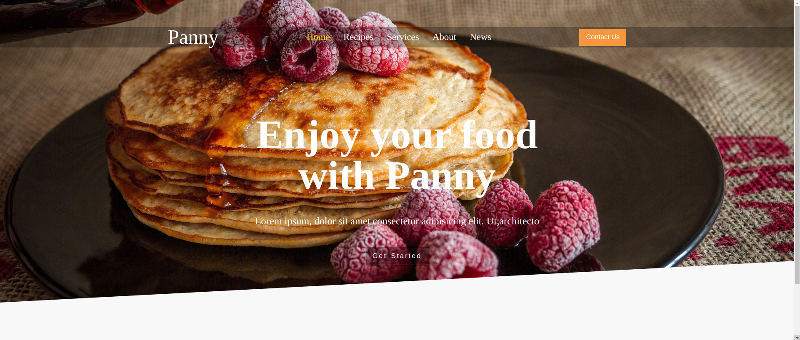

# Goal
The goal of this project is to dynamically render content of a restaurant webpage by using javascript instead of having loading multiple html files.

[Link to site](https://greenzombie123.github.io/webpack-frontend/)

# Features

- When a link is pressed, a page of that link is generated in Javascript

# Tools and Technologies

Visual Studio Code
HTML
Javascript
CSS
Github and Git
Linux Command Line
Chrome Dev Tools
Webpack 

# Things I've Learned
- Learned how to make and use Javascript modules using `export` and  `import`.
- Learned how to use webpack to bundle javascript modules and various assets into one bundle file (and/or other files)
- Learned how to configure `package.json` and `webpack.config.js` 

# Self Reflection
Up until now, almost all of my projects had very large and bloated javascript files, making it difficult to find, refactor, and write code. After learning `import` and `export` and how to use webpack, I was able to make the javascript code modular, making it easier to debug, refactor, and implement new functionality that doesn't affect other parts of the code. 

